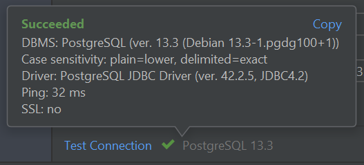

# SQL Crash Course

## Intro

Hi, here are the tasks that I was solving when I started to study SQL. Its cover the basic functionality of the  Structured Query Language. 

I did everything in PostgreSQL. Next there will be instructions for local installation.

### Prerequriments

-  Unix-like OS ([Ubuntu](https://ubuntu.com/))
- IDE for SQL (I use [DataGrip](https://www.jetbrains.com/datagrip/) but you can also in the terminal)
- [Docker](https://www.docker.com/)

## Preparation

Let's do a little preparation of the environment.

## PostgreSQL installation

The database will work in docker, this makes installation very easy. In order for the PostgreSQL to become available on port `5432` with credentials `root`:`root` and database name equal `db`, go to the directory with the [`docker-compose.yml`](docker-compose.yml) file and run the following command:

``` bash
docker-compose up -d
```

  ### Database connection

To work with database, you need to connect to it. To do this, you need to do the following:

1. Select in the settings, connection to PostgreSQL.


2. Enter data into the form.


3. Check the connection.

